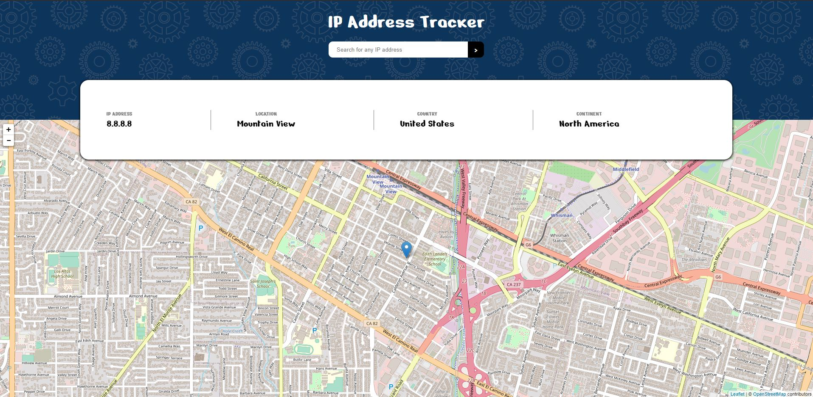

# IP_Address_Tracker
A small website to track an IP address using the ipstack API and displaying the location on a map using Leaftletjs.

If you are cloning this repository, don't forget to get your own API access key at [ipstack](https://ipstack.com/) and replace `ACCESS_KEY` in `index.js` with your own key. 

An image of how it looks:

